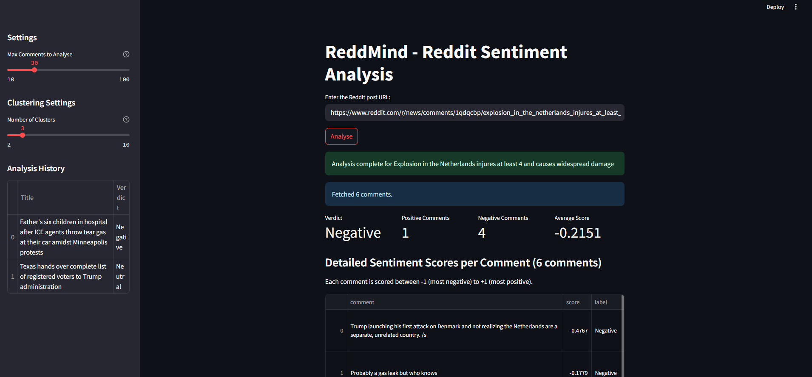
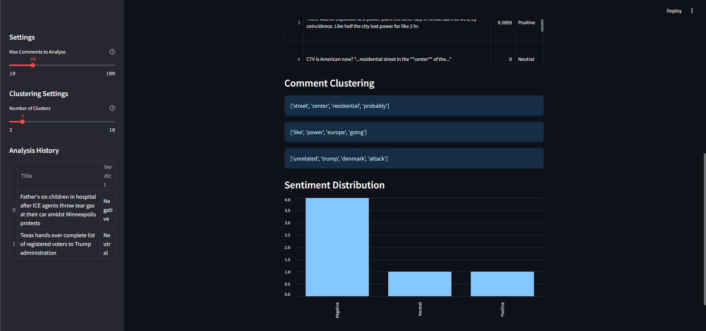

# ReddMind
Local AI tool for Reddit post sentiment analysis. Clusters discussion themes using K-Means.

Built with Python, Streamlit, Scikit-Learn, and VADER.

## Features

* **Sentiment Analysis:** Uses VADER to classify comments as Positive, Negative, or Neutral.
* Uses K-Means Clustering to group similar comments and identify the top themes people are discussing.
* Uses a JSON scraping method to fetch data without API.

To-do:
* Interactive charts showing sentiment distribution.
* Automatically saves your recent searches to a CSV file.

## Installation

1.  Clone the repository

2.  Create a Virtual Environment
    Tested with Conda env Python 3.14.
    ```bash
    # Windows
    python -m venv venv
    venv\Scripts\activate

    # Mac/Linux
    python3 -m venv venv
    source venv/bin/activate
    ```

3.  Install Dependencies
    ```bash
    pip install -r requirements.txt
    ```

## Usage

1.  Run the Streamlit app:
    ```bash
    streamlit run app.py
    ```

2.  The app will open in your browser (usually at `http://localhost:8501`).
3.  Paste a link to a Reddit post (e.g., `https://www.reddit.com/r/technology/comments/...`) and click Analyse.

## How It Works

1.  Scraping: The app appends `.json` to the Reddit URL to fetch raw data.
2.  Preprocessing: It filters out bots, deleted comments, and short text.
3.  Sentiment Scoring: Each comment is scored from -1.0 to +1.0. An average is calculated to give a final verdict.
4.  Clustering:Text is converted into numerical vectors using TF-IDF.
    * K-Means groups these vectors into 3 distinct clusters.
    * The top keywords for each cluster are extracted to label the "Themes".

## Screenshots


